# gbajam26-entries
GBA Jam 2026 entriees

## Downloads

- [Full releases compilation (includes ROMs, screenshots, sources, ..)](https://github.com/gbadev-org/gbajam26-entries/archive/refs/heads/main.zip)

## Games

### Pinball Galaxy Demo Ver
&nbsp;  
by <a href="https://saraitakemoto.itch.io">Sarai Takemoto</a>  
[Project Page](https://saraitakemoto.itch.io/pinball-galaxy-demo-ver) |
[Jam Page](https://itch.io/jam/gbajam26/rate/5006331) |
[ROM File](entries/pinball-galaxy-demo-ver/pgdv260914_jam.gba)

### Hive Keepers Advance
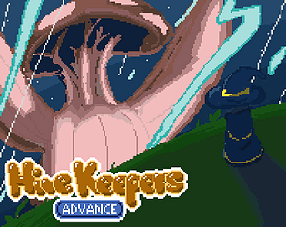&nbsp;  
by <a href="https://6teloiv.itch.io">6TELOIV</a>, <a href="https://akisako.itch.io">Akisako</a>  
[Project Page](https://6teloiv.itch.io/hive-keepers-advance) |
[Jam Page](https://itch.io/jam/gbajam26/rate/4913982) |
[ROM File](entries/hive-keepers-advance/HIVE_KEEPERS_ADVANCE_jam.gba) |
[Source](https://codeberg.org/6TELOIV/gbajam_2026)

### My Beautiful Dere
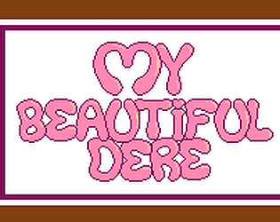&nbsp;  
by <a href="https://songoku2000.itch.io">SonGoku2000</a>  
[Project Page](https://songoku2000.itch.io/my-beautiful-dere) |
[Jam Page](https://itch.io/jam/gbajam26/rate/5003350) |
[ROM File](entries/my-beautiful-dere/my-beautiful-dere_jam.gba)

### GBA MINESWEEPER 6D
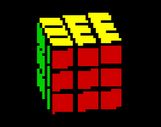&nbsp;  
by <a href="https://codename-b.itch.io">codename_B</a>  
[Project Page](https://codename-b.itch.io/gba-minesweeper-6d) |
[Jam Page](https://itch.io/jam/gbajam26/rate/4800141) |
[ROM File](entries/gba-minesweeper-6d/MINESWEEPER6D_jam.gba)

### GBA GB Maps
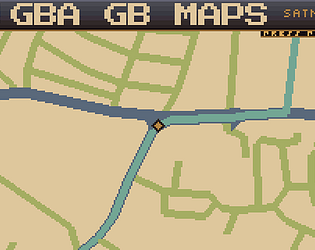&nbsp;  
by <a href="https://codename-b.itch.io">codename_B</a>  
[Project Page](https://codename-b.itch.io/gba-gb-maps) |
[Jam Page](https://itch.io/jam/gbajam26/rate/4894068) |
[ROM File](entries/gba-gb-maps/GBAGBMAPS_jam.gba)

### Forever Witch Fighter GBA
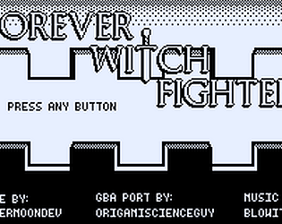&nbsp;  
by <a href="https://origamiscienceguy.itch.io">origamiscienceguy</a>  
[Project Page](https://origamiscienceguy.itch.io/forever-witch-fighter-gba) |
[Jam Page](https://itch.io/jam/gbajam26/rate/5006061) |
[ROM File](entries/forever-witch-fighter-gba/Forever_Witch_Fighter_GBA_jam.gba) |
[Source](https://github.com/origamiscienceguy/GBA_Jam_2026)

### Witch×Bullet
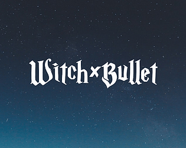&nbsp;  
by <a href="https://coffeepasta.itch.io">CoffeePasta</a>  
[Project Page](https://coffeepasta.itch.io/witchxbullet) |
[Jam Page](https://itch.io/jam/gbajam26/rate/5001434) |
[ROM File]()

### Wizard Battle
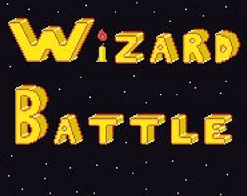&nbsp;  
by <a href="https://tito888.itch.io">Tito888</a>  
[Project Page](https://tito888.itch.io/wizard-battle) |
[Jam Page](https://itch.io/jam/gbajam26/rate/5001703) |
[ROM File](entries/wizard-battle/WIZARDBATTLE_jam.gba)

### Lander Advance
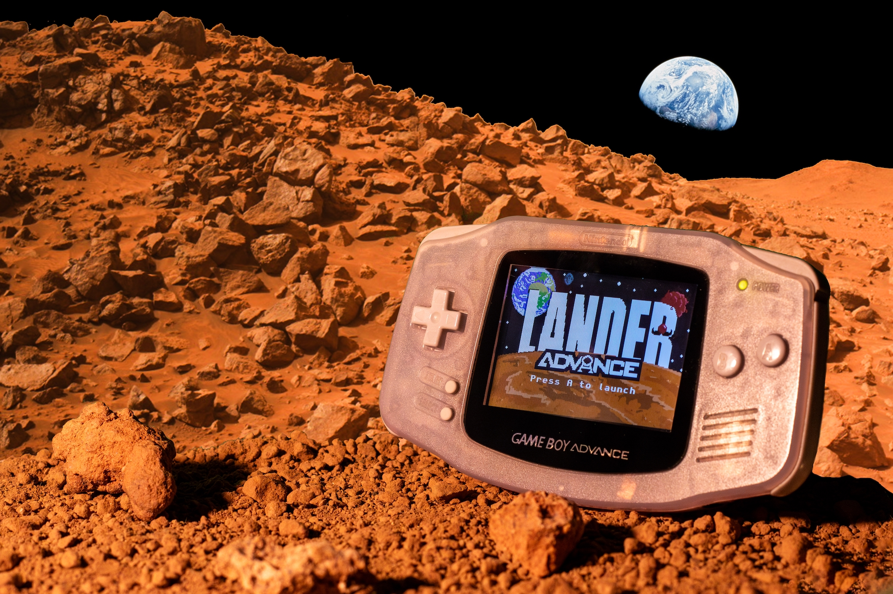&nbsp;  
by <a href="https://edefelice.itch.io">edefelice</a>  
[Project Page](https://edefelice.itch.io/lander-advance) |
[Jam Page](https://itch.io/jam/gbajam26/rate/5005843) |
[ROM File](entries/lander-advance/lander-advance_jam.gba) |
[Source](https://github.com/edefelice/lander-advance)

### Sun Rise
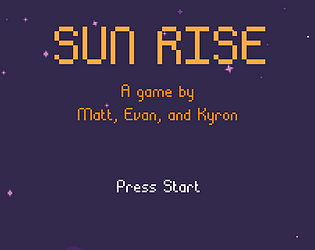&nbsp;  
by <a href="https://mtthgn.itch.io">mtthgn</a>, <a href="https://ef-kyron.itch.io">EF_Kyron</a>, <a href="https://etarrh.itch.io">etarrh</a>  
[Project Page](https://mtthgn.itch.io/sun-rise) |
[Jam Page](https://itch.io/jam/gbajam26/rate/5006416) |
[ROM File](entries/sun-rise/sun_rise.gba) |
[Source](https://git.sr.ht/~mtthgn/sun_rise_gbajam_2026/)

### Cozy Arcade Redemption Game
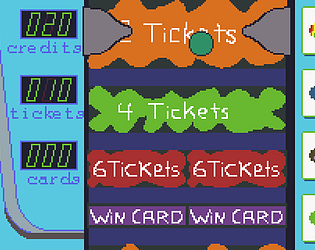&nbsp;  
by <a href="https://tarsi.itch.io">tarsi</a>  
[Project Page](https://tarsi.itch.io/cozy-arcade-redemption-game-gba) |
[Jam Page](https://itch.io/jam/gbajam26/rate/5006788) |
[ROM File](entries/cozy-arcade-redemption-game/COZYARCADEREDEMPTION_jam.gba)

### mimiclime
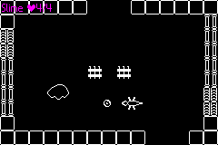&nbsp;  
by <a href="https://copyrat90.itch.io">copyrat90</a>  
[Project Page](https://copyrat90.itch.io/mimiclime) |
[Jam Page](https://itch.io/jam/gbajam26/rate/4580179) |
[ROM File](entries/mimiclime/mimiclime-0.0.5_jam.gba) |
[Source](https://github.com/copyrat90/mimiclime)

### Banan's Peel Out Mini for GBA
&nbsp;  
by <a href="https://plourples.itch.io">plourples</a>  
[Project Page](https://plourples.itch.io/banans-gba) |
[Jam Page](https://itch.io/jam/gbajam26/rate/4814990) |
[ROM File](entries/banan's-peel-out-mini/BanansPeelOutMini_jam.gba)

### Pixel Tower 26
by <a href="https://romw314.itch.io">romw314</a>  
[Project Page](https://romw314.itch.io/pixeltower26-gba) |
[Jam Page](https://itch.io/jam/gbajam26/rate/5005561) |
[ROM File](entries/pixel-tower-26/pixel-tower-26.gba)

### GBA Football League
&nbsp;  
by <a href="https://fliing.itch.io">Fliing</a>  
[Project Page](https://fliing.itch.io/gba-football-league) |
[Jam Page](https://itch.io/jam/gbajam26/rate/5006585) |
[ROM File](/home/exelotl/Dev/gbajam26-entries/entries/gba-football-league/fantasy-football-gba_jam.gba) |
[Source](https://github.com/startfliing/fantasy-football-gba)

### MORDOBOY GBA
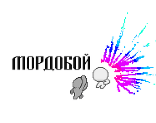&nbsp;  
by <a href="https://lipucka.itch.io">lipucka</a>  
[Project Page](https://lipucka.itch.io/mordoboy-gba) |
[Jam Page](https://itch.io/jam/gbajam26/rate/4976453) |
[ROM File](entries/mordoboy-gba/MORDOBOY_jam.gba) |
[Source](https://codeberg.org/lipucka/MORDOBOY-GBA)

### Madam
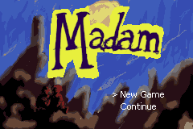&nbsp;  
by <a href="https://hollowbarrel.itch.io">HollowBarrel</a>  
[Project Page](https://hollowbarrel.itch.io/madam) |
[Jam Page](https://itch.io/jam/gbajam26/rate/4936511) |
[ROM File](entries/madam/Madam_jam.gba)

### Spindown
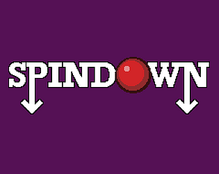&nbsp;  
by <a href="https://sfiera.itch.io">sfiera</a>  
[Project Page](https://sfiera.itch.io/spindown) |
[Jam Page](https://itch.io/jam/gbajam26/rate/4990336) |
[ROM File](entries/spindown/spindown_jam.gba) |
[Source](https://github.com/sfiera/spindown)

### Hungry Ball
&nbsp;  
by <a href="https://oscarh1.itch.io">OscarH</a>  
[Project Page](https://oscarh1.itch.io/hungry-ball) |
[Jam Page](https://itch.io/jam/gbajam26/rate/4809419) |
[ROM File](entries/hungry-ball/HungryBall_jam.gba) |
[Source](https://github.com/EggTree124/Hungry-Ball)

### The Artifact
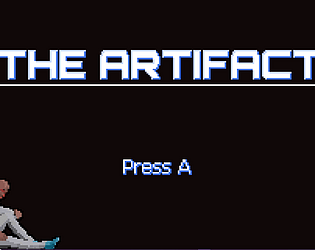&nbsp;  
by <a href="https://eragnarok.itch.io">eragnarok</a>  
[Project Page](https://eragnarok.itch.io/the-artifact) |
[Jam Page](https://itch.io/jam/gbajam26/rate/5004810) |
[ROM File](entries/the-artifact/The_Artifact_jam.gba) |
[Source](https://github.com/gian-hancock/GBA-Jam-26-The-Artifact)

### Super Granny GBA
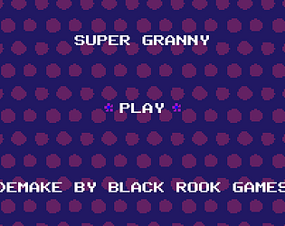&nbsp;  
by <a href="https://blackrookgames.itch.io">Black Rook Games</a>  
[Project Page](https://blackrookgames.itch.io/super-granny-gba) |
[Jam Page](https://itch.io/jam/gbajam26/rate/5006740) |
[ROM File](entries/super-granny-gba/SUPERGRANNYGBA_jam.gba)

### Cat Fish
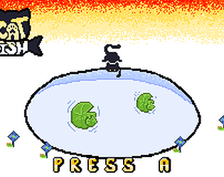&nbsp;  
by <a href="https://goldcube.itch.io">goldcube</a>  
[Project Page](https://goldcube.itch.io/cat-fish) |
[Jam Page](https://itch.io/jam/gbajam26/rate/5006801) |
[ROM File](entries/cat-fish/pounce_jam.gba) |
[Source](https://github.com/alope107/pounce)

### It Matters
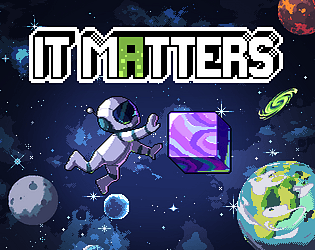&nbsp;  
by <a href="https://gordonshamway23.itch.io">gordonshamway23</a>, <a href="https://wtbasil.itch.io">WTBasil</a>  
[Project Page](https://gordonshamway23.itch.io/it-matters) |
[Jam Page](https://itch.io/jam/gbajam26/rate/4986925) |
[ROM File](entries/it-matters/it_matters_jam.gba)

### Tiny Relic Quest - GBA Edition
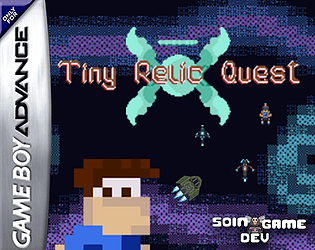&nbsp;  
by <a href="https://soingamedev.itch.io">Soin GameDev</a>  
[Project Page](https://soingamedev.itch.io/tiny-relic-quest-gba-edition) |
[Jam Page](https://itch.io/jam/gbajam26/rate/4870187) |
[ROM File](entries/tiny-relic-quest/TINYRELICQUEST_jam.gba)

### xo89
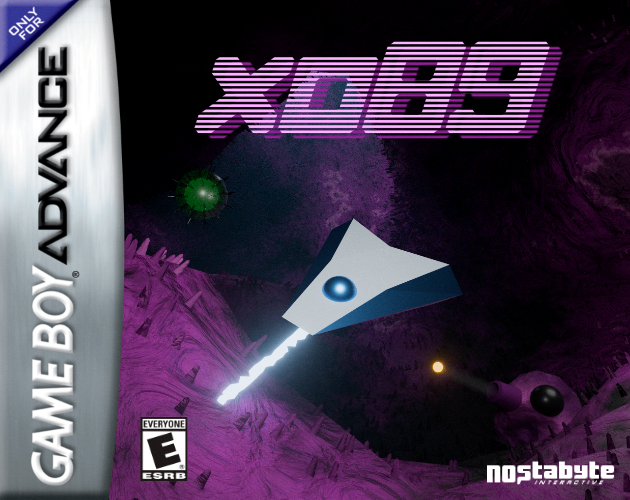&nbsp;  
by <a href="https://nostabyte.itch.io">Nostabyte Interactive</a>  
[Project Page](https://nostabyte.itch.io/xo89) |
[Jam Page](https://itch.io/jam/gbajam26/rate/4974133) |
[ROM File](entries/xo89/xo89_jam.gba) |
[Source](https://github.com/jacobcoughenour/xo89)

### Starfall Advance
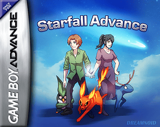&nbsp;  
by <a href="https://dreamnoid.itch.io">Dreamnoid</a>  
[Project Page](https://dreamnoid.itch.io/starfall-advance) |
[Jam Page](https://itch.io/jam/gbajam26/rate/4991297) |
[ROM File](entries/starfall-advance/StarfallAdvance_jam.gba)

### &gt;i
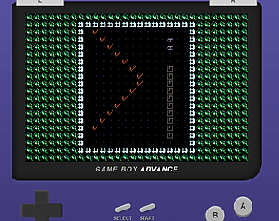&nbsp;  
by <a href="https://zartan917.itch.io">RetroGamma</a>  
[Project Page](https://zartan917.itch.io/i) |
[Jam Page](https://itch.io/jam/gbajam26/rate/4850569) |
[ROM File](entries/greater-than-i/greaterthanIDEMO_jam.gba)

### Doom Escaping
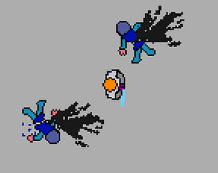&nbsp;  
by <a href="https://ticolol.itch.io">Thiago Amendola</a>  
[Project Page](https://ticolol.itch.io/doom-escaping) |
[Jam Page](https://itch.io/jam/gbajam26/rate/5006681) |
[ROM File](entries/doom-escaping/doom-escaping_jam.gba) |
[Source](https://github.com/thiagoamendola/gba-jam-2026)

### Save The Princess RPG
by <a href="https://chickendude.itch.io">chickendude</a>  
[Project Page](https://chickendude.itch.io/save-the-princess-rpg) |
[Jam Page](https://itch.io/jam/gbajam26/rate/5003039) |
[ROM File](entries/save-the-princess-rpg/SaveThePrincessRPG_jam.gba) |
[Source](https://codeberg.org/RevolutionSoftware/LastLeaves)

### Ballidarity Forever
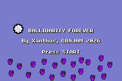&nbsp;  
by <a href="https://xanthus.itch.io">Xanthus</a>  
[Project Page](https://xanthus.itch.io/ballidarity-forever) |
[Jam Page](https://itch.io/jam/gbajam26/rate/5006714) |
[ROM File](entries/ballidarity-forever/Ballidarity_Forever_v0-4_jam.gba)

### Pinball Simulator 2026 Advanced
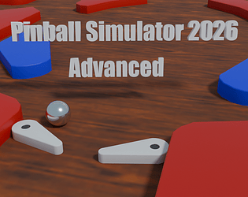&nbsp;  
by <a href="https://fixxiefixx.itch.io">fixxiefixx</a>  
[Project Page](https://fixxiefixx.itch.io/pinball-simulator-2026-advanced) |
[Jam Page](https://itch.io/jam/gbajam26/rate/5004255) |
[ROM File](entries/pinball-simulator-2026-advanced/PinballSimulator2026Advanced_jam.gba) |
[Source](https://github.com/fixxiefixx/PinballSimulator2026Advanced)

### Gravity Cave
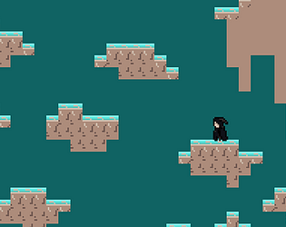&nbsp;  
by <a href="https://ian8tor.itch.io">Ian8tor</a>  
[Project Page](https://ian8tor.itch.io/gravity-cave) |
[Jam Page](https://itch.io/jam/gbajam26/rate/5006336) |
[ROM File](entries/gravity-cave/GravityCave_Jam.gba) |
[Source](https://github.com/Ian8tor/TechnoJimGBA)

### The Space Project Ship
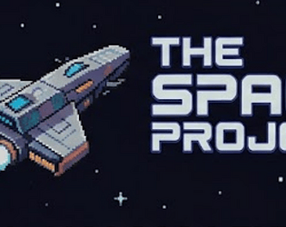&nbsp;  
by <a href="https://intjt2.itch.io">INTJT2</a>  
[Project Page](https://intjt2.itch.io/sps) |
[Jam Page](https://itch.io/jam/gbajam26/rate/4915691) |
[ROM File](entries/the-space-project-ship/TheSpaceProjectShip_jam.gba)

### Noonlight Paradox
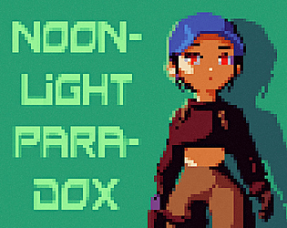&nbsp;  
by <a href="https://zegalur.itch.io">zegalur</a>  
[Project Page](https://zegalur.itch.io/noonlight-paradox) |
[Jam Page](https://itch.io/jam/gbajam26/rate/4996734) |
[ROM File](entries/noonlight-paradox/noonlight_paradox_jam.gba) |
[Source](https://github.com/zegalur/noonlight-paradox-gba)

### Dungeon Tactics
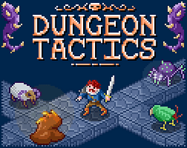&nbsp;  
by <a href="https://setsquare.itch.io">setsquare</a>, <a href="https://lostimmortal.itch.io">LostImmortal</a>, <a href="https://samwilliamssound.itch.io">samwilliamssound</a>  
[Project Page](https://setsquare.itch.io/dungeon-tactics) |
[Jam Page](https://itch.io/jam/gbajam26/rate/4674100) |
[ROM File](entries/dungeon-tactics/dungeon-tactics_jam.gba)

### Sleepyheads
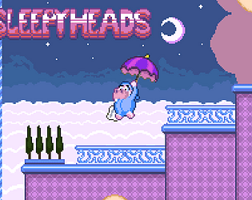&nbsp;  
by <a href="https://vhaugan.itch.io">VHaugan</a>  
[Project Page](https://vhaugan.itch.io/sleepyheads) |
[Jam Page](https://itch.io/jam/gbajam26/rate/5006854) |
[ROM File](entries/sleepyheads/SLEEPYHEADS_jam.gba)

### Let It Recoil!
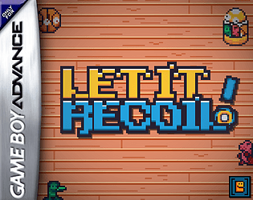&nbsp;  
by <a href="https://bump-dev.itch.io">Bump Dev</a>  
[Project Page](https://bump-dev.itch.io/let-it-recoil) |
[Jam Page](https://itch.io/jam/gbajam26/rate/4964961) |
[ROM File](entries/let-it-recoil/let-it-recoil_jam.gba) |
[Source](https://github.com/Bump-Dev/let-it-recoil)

### Knock Time
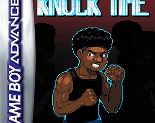&nbsp;  
by <a href="https://stuck-pixel-studio.itch.io">Stuck Pixel Studio</a>, <a href="https://negoro-sama.itch.io">Negoro_Sama</a>, <a href="https://nabo-games.itch.io">Nabo Games</a>, <a href="https://luife.itch.io">Luife</a>  
[Project Page](https://stuck-pixel-studio.itch.io/knock-time) |
[Jam Page](https://itch.io/jam/gbajam26/rate/5006030) |
[ROM File](entries/knock-time/KnockTime_jam.gba)

### Tower of Life
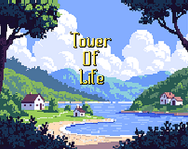&nbsp;  
by <a href="https://nowgames.itch.io">Now Games</a>  
[Project Page](https://nowgames.itch.io/tower-of-life) |
[Jam Page](https://itch.io/jam/gbajam26/rate/4991388) |
[ROM File](entries/tower-of-life/TowerOfLife_jam.gba)

### WFX
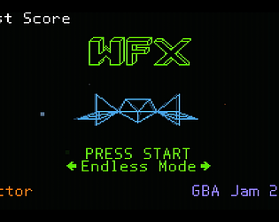&nbsp;  
by <a href="https://factor64.itch.io">Factor</a>  
[Project Page](https://factor64.itch.io/wfx) |
[Jam Page](https://itch.io/jam/gbajam26/rate/5006403) |
[ROM File](entries/wfx/WFX_Jam_2026.gba) |
[Source](https://github.com/Factor-64/WFX)

### Paladado Demo
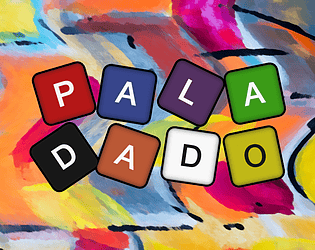&nbsp;  
by <a href="https://christopherthompsonut.itch.io">ChristopherThompsonUT</a>  
[Project Page](https://christopherthompsonut.itch.io/paladado-demo) |
[Jam Page](https://itch.io/jam/gbajam26/rate/5001089) |
[ROM File](entries/paladado-demo/Paladado_jam.gba)

### Butano sprite tool
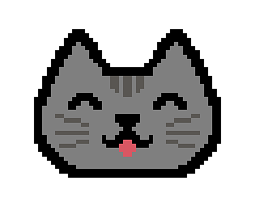&nbsp;  
by <a href="https://songoku2000.itch.io">SonGoku2000</a>  
[Project Page](https://songoku2000.itch.io/butano-sprite-tool) |
[Jam Page](https://itch.io/jam/gbajam26/rate/4933779) |
[ROM File](entries/butano-sprite-tool/sprite_manager_example_jam.gba) |
[Source](entries/butano-sprite-tool/sprite_manager_example.zip)

### Damage Report
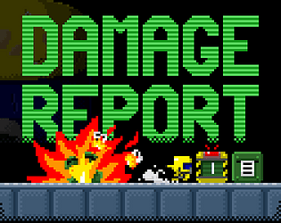&nbsp;  
by <a href="https://setsquare.itch.io">setsquare</a>, <a href="https://lostimmortal.itch.io">LostImmortal</a>, <a href="https://samwilliamssound.itch.io">samwilliamssound</a>, <a href="https://crazy-jake.itch.io">Crazy_Jake</a>  
[Project Page](https://setsquare.itch.io/damage-report) |
[Jam Page](https://itch.io/jam/gbajam26/rate/4810628) |
[ROM File](entries/damage-report/damage-report_jam.gba)

### Breakoid
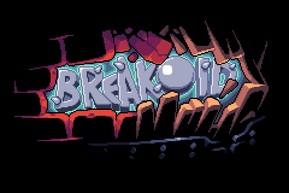&nbsp;  
by <a href="https://xcelfr.itch.io">CeL</a>  
[Project Page](https://xcelfr.itch.io/breakoid) |
[Jam Page](https://itch.io/jam/gbajam26/rate/4836281) |
[ROM File](entries/breakoid/Breakoid_jam.gba)

### Elementary
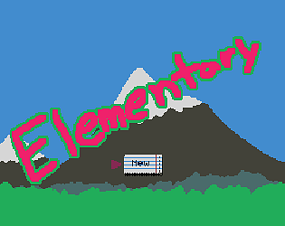&nbsp;  
by <a href="https://viidev.itch.io">veebs</a>  
[Project Page](https://viidev.itch.io/elementary) |
[Jam Page](https://itch.io/jam/gbajam26/rate/5006162) |
[ROM File](entries/elementary/elementary_jam.gba) |
[Source](https://github.com/Astral-C/elementary)

### Brother Jauffre's Untitled Puzzle Game with Two Characters and Three Levels, the Last of Which is Fairly Difficult
&nbsp;  
by <a href="https://brotherjauffre.itch.io">brotherjauffre</a>  
[Project Page](https://brotherjauffre.itch.io/brother-jauffres-untitled-puzzle-game) |
[Jam Page](https://itch.io/jam/gbajam26/rate/5005055) |
[ROM File](entries/brother-jauffre's-untitled-puzzle-game/brother-jauffre's-untitled-puzzle-game_jam.gba) |
[Source](https://github.com/james-lynch-1/ladder-goat)

### Dare To Doku
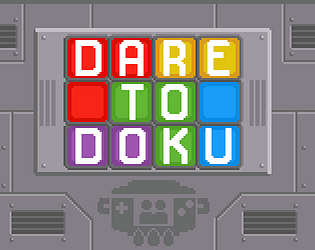&nbsp;  
by <a href="https://daretosquare.itch.io">Dare To Square</a>  
[Project Page](https://daretosquare.itch.io/dare-to-doku) |
[Jam Page](https://itch.io/jam/gbajam26/rate/4964726) |
[ROM File](entries/dare-to-doku/DareToDoku_jam.gba)

### Aurora Mission GBA
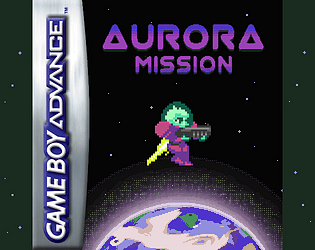&nbsp;  
by <a href="https://rodrigocard.itch.io">Rodrigo Rocha</a>  
[Project Page](https://rodrigocard.itch.io/aurora-mission) |
[Jam Page](https://itch.io/jam/gbajam26/rate/5005251) |
[ROM File](entries/aurora-mission-gba/AuroraMission_jam.gba)

### A Betty and Claude Cartoon
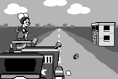&nbsp;  
by <a href="https://drkylstein.itch.io">OutOfSync</a>  
[Project Page](https://drkylstein.itch.io/a-betty-and-claude-cartoon) |
[Jam Page](https://itch.io/jam/gbajam26/rate/5000042) |
[ROM File](entries/a-betty-and-claude-cartoon/betty_and_claude_jam.gba)

### Ounfò Tan Sispann
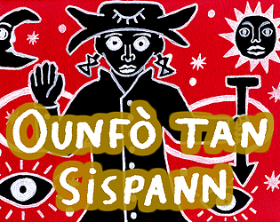&nbsp;  
by <a href="https://fralacticus.itch.io">Fralacticus</a>  
[Project Page](https://fralacticus.itch.io/ounfo-tan-sispann) |
[Jam Page](https://itch.io/jam/gbajam26/rate/5006630) |
[ROM File](entries/ounfò-tan-sispann/ounfo_tan_sispann_jam.gba)

### La Crypte de Pictavie
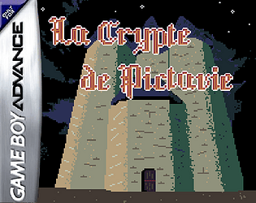&nbsp;  
by <a href="https://eyecrown.itch.io">Théo Carrasco - EyeCrown - 13th Prog</a>  
[Project Page](https://eyecrown.itch.io/la-crypte-de-pictavie) |
[Jam Page](https://itch.io/jam/gbajam26/rate/4945507) |
[ROM File](entries/la-crypte-de-pictavie/LACRYPTEDEPICTAVIE_jam.gba) |
[Source](https://codeberg.org/EyeCrown/La_Crypte_de_Pictavie)

### frog
&nbsp;  
by <a href="https://delphanpan.itch.io">DelphanPAN</a>  
[Project Page](https://delphanpan.itch.io/frog) |
[Jam Page](https://itch.io/jam/gbajam26/rate/4978338) |
[ROM File](entries/frog/frog_jam.gba)

### Ambushed
&nbsp;  
by <a href="https://glitchcauldron.itch.io">Glitch Cauldron</a>  
[Project Page](https://glitchcauldron.itch.io/ambushed) |
[Jam Page](https://itch.io/jam/gbajam26/rate/4931672) |
[ROM File](entries/ambushed/ambushed_jam.gba)

### Nave gba
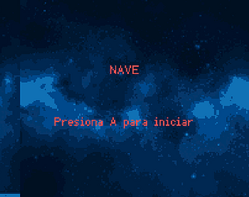&nbsp;  
by <a href="https://the-dharex.itch.io">the dharex</a>  
[Project Page](https://the-dharex.itch.io/nave-gba2) |
[Jam Page](https://itch.io/jam/gbajam26/rate/4772630) |
[ROM File](entries/nave-gba/nave_jam.gba)

### Spelunky GBA
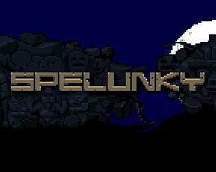&nbsp;  
by <a href="https://thedarknessuser.itch.io">thedarknessuser</a>  
[Project Page](https://thedarknessuser.itch.io/spelunky-gba) |
[Jam Page](https://itch.io/jam/gbajam26/rate/5006731) |
[ROM File](entries/spelunky-gba/SPELUNKYGBA_jam.gba)

### Antibody
&nbsp;  
by <a href="https://pyro-pyro.itch.io">Pyro_Pyro</a>, <a href="https://exelotl.itch.io">exelotl</a>, <a href="https://reyoruga.itch.io">ReyOruga</a>, <a href="https://pixel-jamp.itch.io">Pixel _Jamp</a>  
[Project Page](https://pyro-pyro.itch.io/antibody) |
[Jam Page](https://itch.io/jam/gbajam26/rate/5002295) |
[ROM File](entries/antibody/Antibody_jam.gba)
